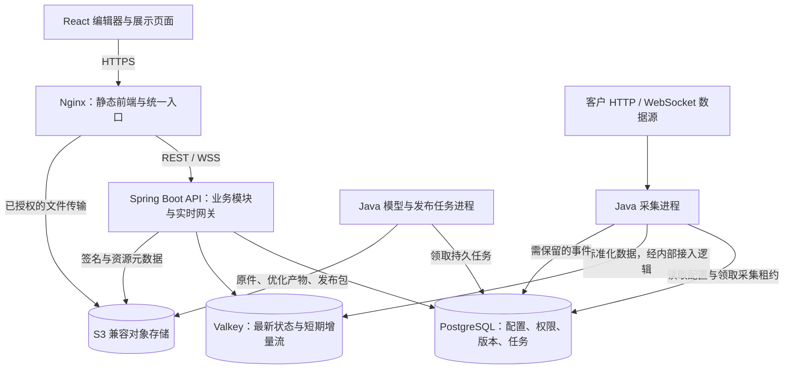

后端架构设计建议｜2026-09-17

状态：目标设计，已落地本地 Java 首版。用户随后授权创建代码和本地服务；实际完成项、验证方式与待办以 [Java 后端说明](../apps/backend/README.md) 为准。本文中的目标容量、发布/优化、多租户生产治理与高可用不应视为已实现。没有切换现有线上服务或迁移生产数据。

推荐采用 **Java + Spring Boot 模块化 API、独立 Java 采集进程、独立 Java 任务进程、PostgreSQL、Valkey 实时状态层、S3 兼容对象存储，以及 Docker Compose 标准交付**。初期可在一台服务器运行，按负载把应用进程和存储迁出；客户现场与统一托管共用同一套版本化产品。

Java 优先的依据是已有团队的实现、维护与交付能力，不能据此推断未经压测的吞吐上限。前端继续使用 React/TypeScript；双方通过版本化 HTTP/WS 契约衔接。Java 版本选团队已验证且仍有安全维护的 LTS，Spring Boot 选与该 JDK、数据库驱动和关键客户端兼容的受维护稳定版本，交付前锁定补丁版本与镜像摘要。

业务模块保留在同一个代码库和发布版本中。进程拆分用于隔离长连接、外部网络等待与模型处理负载，不要求现在引入微服务治理、服务网格或 Kubernetes。单机版的故障恢复依靠备份与重启；需要主机故障自动切换时，必须另行部署跨主机冗余。

**1. 当前前端与后端的兼容基础**

本次核对了前端 API 封装、共享数据契约、资源运行层、Worker 路由、数据库与对象存储接口，以及已有架构记录。没有访问生产数据，也没有执行性能压测。

| 当前事实 | 新后端应如何承接 |
| --- | --- |
| React 19 + TypeScript + Vite + Three.js；独立 SceneRuntime 管理渲染 | 保留前端技术栈；后端不承担逐帧渲染或下发完整 Three.js 对象 |
| `/api/v1`、携带 Cookie 的请求封装、`error/message/requestId` 错误结构 | 迁移时保持现有接口和错误语义；新增能力通过明确版本和能力声明接入 |
| 已有用户、会话、全局角色和项目角色 | 保留单套部署内的原有权限；统一托管新增租户边界 |
| 2D 画布、独立 3D 场景分别持久化，已有 `expectedRevision` 增量保存 | 保留两个文档各自的修订号；发布时组合它们的确定版本 |
| 资源以 ID 引用，场景内资源复用、最多 3 个加载任务 | 保留资源 ID；新增资源版本、派生产物和区域清单 |
| 浏览器按资产轮询，服务端在每次请求内采集上游 | 替换为按数据源集中采集，浏览器读取共享快照和订阅增量 |
| 当前运行环境为 Cloudflare Worker + D1，文件接口面向 R2 | 迁移运行时、SQL、事务和对象存储适配器；不是只改连接地址 |

具体依据：[前端 API 封装](</Users/doudou/Documents/3D 平台/factory-digital-twin-platform/apps/web/src/api.ts>)、[逐资产轮询](</Users/doudou/Documents/3D 平台/factory-digital-twin-platform/apps/web/src/twin/useAssetRuntimeConnections.ts>)、[请求内采集](</Users/doudou/Documents/3D 平台/factory-digital-twin-platform/apps/api/src/runtime-state.ts>)、[运行层说明](</Users/doudou/Documents/3D 平台/factory-digital-twin-platform/docs/frontend-scene-runtime.md>)。

目前单模型上传上限是 25 MiB；独立场景预算是 128 个实例、24 个唯一模型、150 MiB 唯一模型文件、6,000 个估算网格实例、24 个活动动画实例，单次补丁最多 100 个实例变更。它们是当前保护性限制，不是架构最终容量或性能承诺。后端能存更多实例，不代表浏览器能同时渲染更多实例。

既有架构记录中的 Fastify/PostgreSQL/S3 和 REST 快照 + SSE 属于此前建议。本次根据 Java 团队资源将业务框架调整为 Spring Boot，保留 PostgreSQL/S3；考虑明确提出的 WebSocket、多订阅和扩容需求，浏览器增量通道首版统一选 WebSocket。SSE 可以作为后续显式启用的传输适配器，不同时维护两套实时业务逻辑。Java 首版已另行实现，现有 Worker 继续保留。

目前前后端复用的 `shared/*.ts` 校验函数不能被 Java 直接复用。迁移时建立语言无关的 OpenAPI、JSON Schema 与正反样例，作为接口字段、画布/场景配置、枚举、单位和限制的共同依据；由契约生成或校验 TypeScript/Java 类型，并执行相同样例的契约测试。跨资源引用、权限、版本竞争等业务约束继续由服务端事务和授权逻辑执行，不能认为生成 DTO 即完成校验。切换前保持现有 TS 规则，逐项核对 Java 对缺失值/null、数值范围、日期、错误码和超限输入的处理，防止两端规则漂移。

**2. 进程和存储如何划分**

图中前端、API、文件传输使用明确配置的地址；直传可以经过只转发字节的文件代理。API 鉴权通过后，大文件不经过 Java 业务处理进程。对象存储路径与签名的 Host/path 必须一致；部署模板要验证上传、Range 和缓存头的完整链路。

| 组件 | 主要职责 | 初期部署 |
| --- | --- | --- |
| Nginx | TLS、静态页面、API/WS 反向代理、文件入口 | 1 个容器 |
| API | 身份与租户、项目、资产、画布、场景、资源、发布、运行快照、WebSocket | 1 个容器，内部按领域拆模块 |
| Collector | HTTP 定时采集、上游 WS 长连接、字段映射、限流、陈旧判定 | 1 个容器，按数据源调度 |
| Worker | 模型检查、压缩、缩略图、区域资源准备、导入导出、发布包任务 | 1 个容器，CPU/内存/并发单独限制 |
| PostgreSQL | 有事务要求的业务事实、权限、审计、版本和持久任务 | 1 个容器或外部数据库 |
| Valkey | 最新设备状态、短期可补发数据流、多副本网关分发 | 1 个容器或外部服务 |
| S3 兼容存储 | 模型、图片、视频、音频、纹理、导入报告、发布包 | 1 个单机存储容器或外部存储 |

完整本地部署为约 7 个容器，其中只有 3 个是应用进程；用一套 Compose 和统一版本交付。GPU 重建不属于默认依赖。模型 Worker 由 Java 管理任务、权限、租约与结果，独立镜像预装所需原生工具或 Node.js CLI；API 与采集器不因此增加 Node.js 服务依赖，均属于同一产品版本。

Java 实现建议如下：

| 能力 | 首选实现与边界 |
| --- | --- |
| HTTP 业务接口 | Spring Boot + Spring MVC，按身份、项目、画布、场景、资源、发布、数据源划分业务模块 |
| 登录与授权 | Spring Security 接入既有登录/会话契约，显式实现租户和项目授权、CSRF、Origin 与撤销检查 |
| 实时网关 | Spring WebSocket 承载有版本的原生 JSON 订阅协议；首期无需额外 STOMP Broker |
| 数据访问 | Spring JDBC 显式 SQL 与事务，便于审查 revision 条件更新、租户条件和批量写入；数据库迁移工具统一管理版本 |
| 采集与任务 | 同一 Java 工程中的独立启动模块，网络、调度、任务执行使用有界线程池、队列和超时 |
| 诊断 | Actuator 健康/指标与结构化业务日志；管理端点仅向授权运维入口开放 |
| 工程构建 | Java 使用统一构建工具及 Wrapper，前端继续 pnpm；CI 统一版本、契约检查与镜像发布 |

Spring 官方提供 WebSocket 集成、Servlet 安全框架与生产健康/指标能力。[Spring WebSocket](https://docs.spring.io/spring-boot/reference/messaging/websockets.html)、[Spring Security](https://docs.spring.io/spring-security/reference/servlet/index.html)、[Actuator](https://docs.spring.io/spring-boot/reference/actuator/index.html)。具体连接数和吞吐仍需本项目压测。首版不为框架选择引入 Spring Cloud、注册中心或配置中心；也不因使用 WebSocket 就要求整个业务后端改用 WebFlux。

WebSocket 连接回调不执行模型处理、长事务或慢上游采集；每连接的发送串行化并限制积压。JVM 堆、直接内存、线程栈与工具子进程共同计入容器预算，不能把全部容器内存分配给堆。API、采集器和任务进程分别设置数据库连接池上限，多副本的连接总数应纳入 PostgreSQL 容量预算。

引入 Valkey 的理由是采集与 WebSocket 已分属不同进程，未来还需多副本共享状态；Java 客户端需验收实际使用的命令、Streams、认证和连接恢复。配置、权限、发布记录和必须保留的事件继续由 PostgreSQL 负责，不只放在缓存。模型任务初期用 PostgreSQL 持久任务表和适配 PostgreSQL 的成熟 Java 任务库承接，暂不再添加 Kafka/RabbitMQ。多 Worker 领取任务需要短事务锁、租约、超时恢复、幂等键和失败状态，不能只依赖进程内数组。[PostgreSQL 队列型读取说明](https://www.postgresql.org/docs/current/sql-select.html)。

**3. 三类前端流量分别设计**

| 流量 | 推荐协议 | 数据与调用方式 |
| --- | --- | --- |
| 配置和业务操作 | HTTPS REST/JSON | 登录、项目、资产、画布补丁、场景补丁、发布、任务查询；事务、分页、权限和版本冲突 |
| 实时业务状态 | HTTPS 初始快照 + WSS 增量 | 按项目、资产、指标订阅；共享采集、批量推送、重连和陈旧状态 |
| 大文件与大项目装载 | HTTPS 文件传输 + 清单/分块接口 | 分片上传、断点续传、哈希校验、按区域与版本下载；不塞进 WebSocket 消息 |

HTTP 客户数据源与浏览器 HTTP 请求是不同的方向。数据源可以提供 HTTP 或 WebSocket；平台采集器负责接入，浏览器只消费平台标准化后的契约。上游 WS 和下游 WS 不需要一一对应。

画布配置继续以数据库中的节点/实例记录为可编辑事实；组件 props 可用受 schema 校验的 JSONB，项目归属、权限、引用、排序、版本等可查询字段使用正式列和约束。保存一个节点只传变化节点。继续使用 `expectedRevision`，在同一个 PostgreSQL 事务中比较并更新版本、校验引用、写入变更。发生冲突返回 409 并保留草稿，由用户处理冲突；不静默覆盖另一位编辑者。

大项目读取先返回 manifest，再按区域/页面取节点、实例和资源引用，所有块绑定同一修订号，避免分页过程中读到混合版本。旧 v1 的整体文档契约保持兼容；超过旧客户端能力的分区文档要有新 schema/接口能力和明确的升级提示。不能要求旧客户端透明支持其从未实现的大场景。

批量导入或超过单次补丁预算的“大保存”使用临时导入任务，分批校验后一次提交新修订；中途失败不暴露半份项目。常规 HTTP 请求继续设置解压后体积、条数、深度与超时限制；大项目不通过无限放宽 body size 解决。

发布记录固定引用 `2D 修订 + 3D 修订 + 资源版本 + 数据绑定修订 + schema 版本`。预览可以读有权限的草稿，正式运行只读发布组合；修改草稿不改变已发布页面。发布前验证引用、权限、资源就绪状态和性能预算；资源失败不能部分发布。对象产物先写入不可变键并校验，最后用数据库事务切换生效发布指针。回滚选择旧发布组合。

这里的发布 manifest 是从正式 schema 生成的不可变运行产物，不是另一套可编辑数据模型。被发布版本引用的资源需要保留；删除和垃圾清理必须尊重引用与保留期，不能使旧发布版本无法恢复。

**4. 实时链路要先解决重复采集与恢复一致性**

目标链路：客户数据源 → 集中采集 → 映射/校验 → 最新状态和短期增量 → 页面级共享状态仓库 → 2D 组件与 3D 外观。

同一个租户内，同一个数据源配置和认证上下文在同一采集周期只由一个有效持有者执行采集，再服务多个项目查看者。若上游接口必须逐设备请求，则仍需相应请求数，但不能再乘以浏览器人数。不同租户或不同认证上下文不能因 URL 相同而混用结果。

例如 20 人各查看 50 台设备、每秒刷新一次，逐资产轮询会产生约 1,000 次平台请求/秒。如果这 50 台设备来自同一个能一次返回全部设备的接口，集中采集可把上游访问降为每秒一次；下游流量仍由订阅人数和字段量决定。

采集进程要具备连接超时、受控重试和抖动、单数据源并发限制、速率预算、源时间戳、采集时间戳和逐指标质量状态。多个采集副本按数据源分片并使用带代次的租约；租约丢失后停止采集，接入端拒收旧代次，避免旧进程写回过时状态。无法保证网络故障下上游物理请求绝不重复，因此数据摄入也必须可去重。

浏览器首版每个页面维护一条共享 WSS 连接，可以订阅多个获授权项目。组件声明所需资产和字段，由共享状态层合并订阅；组件本身不建立连接，也不各自轮询。消息只携带变化字段及必要上下文，按可配置短窗口批量推送；展示刷新与网络接收分开，React 与 Three.js 分别做批量更新。初始可压测 100–250 ms 合并窗口，不能把它当成现场要求的既定值。

建议事件契约包含 `schemaVersion、projectId、assetId、sourceId、sourceTimestamp、collectedAt、quality、values、streamEpoch、cursor`。租户由鉴权上下文确定；内部事件、缓存键与队列任务必须携带租户。单位、类型、阈值等稳定映射元数据按版本加载，避免每次增量重复发送。设备业务状态与数据链路状态分别表达；某个指标的更新不能掩盖另一指标已经陈旧。

初始快照返回对应游标；后续只消费游标之后的增量。最新值更新和增量流追加必须形成一致边界，例如在同一 Valkey 分区中原子执行；读取按有界资产批次获得快照和游标，大清单由订阅握手缓冲后续增量，避免“先快照后订阅”的丢更新窗口。重复消息按游标/源序号去重，恢复窗口过期或状态缓存重建时返回 `resync_required`，更换 epoch 后重新获取快照。

Valkey Streams 只承担有界的短期补发，保留时间和字节都有配额；不能无限缓存所有历史。多个 WebSocket 副本各自读取所需项目流并给本地连接分发，不能用同一个竞争消费组导致某些副本收不到消息。普通 Pub/Sub 无法补发断线期间的消息，不能作为唯一可靠事件来源。[Valkey Streams](https://valkey.io/topics/streams-intro/)、[Pub/Sub 交付语义](https://valkey.io/topics/pubsub/)。

浏览器和网关都需要有界发送缓冲。积压时，对于明确定义为“最新状态”的指标可以合并中间值，并暴露积压、合并计数与当前延迟；告警、状态转变记录和任务结果若要求保留，先持久化，再通过 outbox 重试通知，按事件 ID 去重。持续过载则断开慢连接并要求重同步，不能无限占用内存或悄悄丢告警。控制业务动作不纳入当前只读展示链路。

WebSocket 心跳、代理空闲超时、指数退避与抖动、会话到期关闭、订阅恢复都属于正式协议。权限变更主动失效相关订阅，并用定期授权复核限制通知丢失的影响；令牌撤销后不能继续无限接收数据。上游失败立即标记失联；源时间戳超期标记陈旧。可以保留最后成功值供定位，但必须同时展示时间与质量状态。

**5. 模型、媒体和对象存储**

数据库保存资源 ID、租户和项目归属、对象键、字节数、内容哈希、版本、检查结果和引用关系。对象存储保存实际文件，画布只引用资源 ID。对象键由服务端生成，租户/项目范围通过资源授权确定；前端不得传一个任意对象键来领取下载签名。

大文件流程为：创建上传会话并预留配额 → 获得短时分片上传授权 → 浏览器分片直传 → 服务端完成合并并核对对象 → Worker 检查/派生 → 状态变为可用。上传完成不等于模型校验通过。需提供 `uploading / processing / ready / failed` 和具体任务进度、失败原因；取消与失败分别记录。过期会话释放配额并清理未完成分片。[S3 Multipart Upload](https://docs.aws.amazon.com/AmazonS3/latest/userguide/mpuoverview.html)。

上传会话限制文件数、单文件/总字节、分片数量和有效期；最终依据真实对象重新校验，不能只信前端声明。内容哈希使用明确算法，不能把 multipart ETag 默认当作整个文件的 MD5。原始文件保留，优化失败保留诊断报告；未经验证的资源不进入正式发布。大型导入校验在受限 Worker 中进行，解析时限制解压体积、纹理尺寸、内存、CPU 和运行时长。

下载时经过资源权限校验，返回短时签名地址，或通过受保护文件网关按授权传输。模型加载器和媒体组件封装这个差异，不把存储品牌或永久外链暴露进项目 JSON。签名地址在有效期内属于可转发凭证；要求权限撤销立即作用于每次读取的客户使用文件网关。任何方式都无法收回已经下载到用户设备的数据。

公开内置演示模型可按内容哈希长期缓存；私有模型不可进入未做租户隔离的公共缓存。视频、音频和大资源链路应支持 Range、ETag、正确 MIME 与签名续期。HTTP Range 支持续传，不等于一个整体 GLB 自动支持可视区域流式渲染；大型场景仍需区域分包与 LOD。

模型处理流水线检查格式、节点唯一性、单位、三角面、primitive、纹理、动画和包围盒，生成优化文件与报告。使用 glTF Transform/Meshopt/KTX2 等工具时保留稳定节点、动画与绑定契约，优化器合并/重命名节点可能破坏业务映射，必须验证或提供可追溯映射。[glTF Transform CLI](https://gltf-transform.dev/cli)。

模型工具不要求改写为 Java。Java Worker 通过受控参数启动镜像内预装工具，捕获退出码、耗时和脱敏后的诊断输出，设置超时并终止超时任务的子进程；不得拼接用户 shell 命令、运行时下载 npm 依赖或在工具失败后把资源标为 ready。

对象存储选型建议如下：

| 部署条件 | 建议 |
| --- | --- |
| 客户已有受维护的 S3/MinIO 兼容服务 | 使用适配器接入，验收实际所需 API 能力 |
| 新建离线/私有部署 | 建议以 SeaweedFS 单节点 S3 模式作为首个验证与交付基线，再验证分片、签名、Range、权限、备份和升级 |
| 统一托管 | 优先使用所在地可用的托管对象存储，降低维护磁盘与多副本的负担 |
| 客户指定 MinIO 产品 | 明确其具体产品、版本与维护渠道，再接入同一适配器 |

截至本次核实，原 `minio/minio` 社区仓库于 2026-04-25 归档，首页明确声明不再维护。因此不建议把旧社区版作为新产品唯一的默认存储依赖。这个结论不等于所有 MinIO 商业产品停止维护。[MinIO 官方仓库](https://github.com/minio/minio)。SeaweedFS 官方提供单进程 `weed mini` 的 S3 部署与 Docker 路径，可用于控制初期部署数量；是否适合本产品仍要通过上述兼容和恢复验收。[SeaweedFS 官方仓库](https://github.com/seaweedfs/seaweedfs)。

**6. 多用户与多租户**

统一托管从第一版建立 `tenant → projects/resources/data-sources/memberships` 隔离。客户独立部署初始化一个租户，隐藏租户切换，但使用相同 schema、授权和导入导出流程，不维护单独分叉版本。

保留现有项目 `owner/editor/viewer` 语义。新增租户管理员，负责本客户成员、项目与配额；云平台运维身份与租户管理员分离。现有单机 `platform_admin` 迁移后保留该部署内的管理能力，不能直接变成统一托管下能访问所有客户数据的普通客户角色。跨客户运维访问采用独立、受审计的授权路径。

租户边界覆盖数据库、缓存键、WS 订阅、上传签名、对象路径、队列任务、审计与导出包。租户 ID 由服务端确认的会话/采集器凭据解析；客户端提交 tenantId 不构成授权。数据库使用非空 tenant_id、包含租户范围的唯一约束和外键，避免关系记录跨租户链接。PostgreSQL RLS 作为第二层保护，业务连接不得使用超级用户、BYPASSRLS 或可绕过策略的表 owner；连接池中的租户上下文必须按事务设置并清除。[PostgreSQL RLS](https://www.postgresql.org/docs/current/ddl-rowsecurity.html)。

当前 `assetId` 是项目上下文中的稳定业务编号，不假设全平台唯一。先保留现有项目归属与显式 2D/3D 关联，用“租户 + 资产所属项目 + assetId”定位设备。跨项目读取必须验证源项目/资产授权，不能只因字符串相同就自动关联。后续若需要多个项目共同管理同一工厂台账，再设计租户内共享资产空间；本轮不要求先做这项迁移。

认证继续使用同源 HttpOnly、Secure、SameSite Cookie 与可撤销服务端会话；写操作加入 CSRF/Origin 校验，WS 握手验证 Origin、会话和订阅权限。多 API 副本共享会话事实，登录状态不只存在进程内存。保持既有登录接口的账号/邮箱兼容；迁移旧密码哈希时保留原算法参数并设计登录后的升级。生产密码约束按项目既有规则恢复，初始化无默认密码，测试凭据必须轮换。

本地账号满足独立部署；企业已有身份系统时增加 OIDC 对接，不把额外的身份服务器列为每套安装的强制组件。用户管理、改密、禁用、退出、权限修改都有审计与撤销语义。大屏只读账号也必须受项目授权；公开演示资源继续与客户资源隔离。

统一托管还需要每租户的文件容量、上传并发、采集频率、连接数、订阅数、推送带宽、任务并发与历史保留配额。大租户可被路由到独立采集进程、网关或数据库部署，避免一位客户拖慢全部客户。

**7. 两种部署与渐进扩容**

| 场景 | 部署方式 | 数据接入 |
| --- | --- | --- |
| 客户独立部署 | 一台 Linux 主机 + Docker Compose，可使用客户已有 PostgreSQL/S3 | 采集器在客户网络内访问数据源；完全离线时不依赖外部 CDN、登录或镜像拉取 |
| 平台统一托管 | 同一应用版本，优先托管数据库/缓存/对象存储，按需增加 API/WS 副本 | 公网数据源由云端采集器接入；内网数据源使用现场 Collector |
| 较大现场或较大租户 | 将数据库/对象存储、模型 Worker 和采集器按瓶颈分别迁出 | 按数据源分片、独立网络区域与资源配额 |

现场 Collector 使用租户绑定的服务身份，主动通过 HTTPS/WSS 连接云端接入端点；无需让客户公开内网设备地址。云端不把任意 URL 变成开放代理，不向现场发送任意 shell 命令。客户源密钥优先保留在现场；配置下发与凭据更新有版本、最小权限和审计。浏览器与外部 Collector 都不得直接连接云端数据库或 Valkey。

如果客户网络完全隔离且不允许任何出站连接，实时数据只能在独立部署内运行；云端可以接收显式导出的项目包，但不能承诺跨隔离网络实时同步。需要断网后继续在现场看实时画面时，应提供本地运行服务，仅有云端页面和上报采集器不足以满足这个要求。

现场上报以确认后的序号推进；需保留的事件在有界磁盘缓冲中重试，重复上报可去重。最新状态可按明确策略合并；缓冲容量不足要显示告警和缺口，不能伪装成无损。HTTP 源允许的目标主机/网络段按租户现场配置，云端禁止访问元数据服务等未授权目的地，连接和重定向过程都维持边界。

Docker 明确采用。Compose 适合初期单机生产交付，官方也提供单服务器生产部署说明。[Docker Compose 生产文档](https://docs.docker.com/compose/how-tos/production/)。分布式能力提前设计，但默认不部署跨机器集群：API 外置会话与业务状态，WS 本地只持有本机连接，Collector 使用租约，Worker 使用持久任务，对象存储不依赖 API 本地目录。

| 观测到的瓶颈或服务要求 | 下一步 |
| --- | --- |
| 模型任务影响 API 延迟或主机内存 | 优先给 Worker 设资源预算，再迁到独立机器并扩 Worker |
| WS 出站带宽、消息分发排队、发送延迟或连接缓冲持续超预算 | 将实时网关从 API 进程独立部署并增加副本，共享事件源；重连可到任意副本 |
| 采集任务排队、上游连接数或某网段延迟过高 | 按租户/数据源/现场增加采集进程，维持租约与上游限额 |
| 数据库锁等待、查询延迟或 I/O 持续成为主因 | 先索引、批量操作与查询治理，再独立主机、连接池或只读副本 |
| 文件出口饱和 | 独立文件入口、对象存储扩容、受权限约束的缓存；不会靠增加 API CPU 解决 |
| 全量指标历史写入/查询超过配置库预算 | 独立时序/分析存储，分区、降采样和保留策略 |
| 要求主机失效时自动恢复 | 跨主机应用副本与负载均衡，同时补齐 PostgreSQL、缓存和对象存储的冗余/故障切换 |

WebSocket 建立后由负载均衡保持该 TCP 连接；重连可落到其他副本，不能依赖某台机器内存中的唯一订阅事实或最新业务状态。Kubernetes 仅在统一托管的节点数量、滚动升级与自动调度需求确实值得其成本时引入，客户现场不因此被迫使用 Kubernetes。两台主机上启动更多容器也不等于数据库与文件已经高可用。

**8. 大项目容量和前后端共同预算**

目前尚未收到实际规模数字。以下是用于测量的示例，不是已通过的容量或推荐采购配置。

后端关注上游请求/秒、资产更新/秒、指标点/秒、订阅扇出、文件吞吐、并发保存、数据库 I/O 和任务内存。浏览器关注首屏实际加载字节、解码时间、显存、draw calls、三角面、动画骨骼和页面组件刷新成本。文件数量、实例数量、唯一模型数量与同时可见实例数量必须分开计量。

假设 1,000 台设备，每台 5 个指标，每秒更新；100 个同时在线页面，每页只订阅 200 台设备：

- 标准化输入约 1,000 份资产更新/秒、5,000 个指标值/秒；上游请求量取决于源接口是否批量返回。
- 推送扇出约 20,000 份资产更新/秒。若每份变化约 250 字节，原始有效载荷约 5 MB/s，即 40 Mbit/s，尚未计协议、TLS、其他业务和峰值。
- 若频率增至 10 Hz，同样假设下约 50 MB/s，即 400 Mbit/s；连接数没有变化，带宽和序列化成本却增加十倍。
- 若 5,000 个指标值/秒全部逐点留存，每天就是 4.32 亿点。因此默认不要把所有实时值无限写进 PostgreSQL，优先接客户历史系统；平台自存历史需明确采样、聚合和保留期，确有规模再配置专用存储。

场景总资源数 GB 并不意味着首屏下载数 GB。后端提供区域边界、实例归属、LOD 资源、检查指标和加载优先级；前端落实区域加载/卸载、资源复用、实例化与细节等级，才能增加大型项目可承载规模。当前前端的相关能力仍有待实现，不能只提高 128/150 MiB 等现有限制。

可先以 8 vCPU、16–32 GiB 内存、SSD 的 Linux 环境作为基准压测起点，限制模型任务并发，随后依据结果选型；它不是对上述示例规模的保证。磁盘按原件、优化版本、发布引用、临时上传/处理空间、历史留存和独立备份分别核算；模型解码峰值内存可能远大于压缩文件体积。

性能验收至少测：代表性当前项目、预期大项目及其高峰组合；冷/热资源加载、多人同时打开大屏、大文件上传同时保存画布、模型优化同时推送、慢客户端、上游断开、重连风暴、缓存重启，以及 24–72 小时运行。记录硬件、模型清单、刷新频率、P95/P99 延迟、数据端到端时延、失败率、事件缺口、队列等待、内存趋势和浏览器帧耗时。验收阈值需结合客户网络和数据源 SLA 确定，不能只测框架空接口 QPS。

**9. 控制运维成本的交付标准**

每个产品版本交付固定镜像清单/摘要、Compose、配置模板、数据库迁移、管理员初始化步骤、备份恢复工具和升级说明。现场离线包包含 Java 运行时与应用镜像、前端资源、模型解码器和处理工具，不在运行时下载 Maven/npm 依赖、访问外部字体/CDN 或要求连接云端才能登录。证书由客户提供或由本地可信 CA 签发，不能假设离线环境能申请公网证书。

管理员日常操作集中在启动、停止、查看状态、升级、备份和恢复；不要求逐个理解底层组件。后台提供系统诊断视图，展示数据库/存储状态、可用磁盘、连接数、数据源状态、最近采集、任务积压、备份结果和产品/schema 版本；高级指标可接客户监控，完整监控套件作为可选运维配置。

日志至少含 requestId/jobId、tenantId、projectId、sourceId/resourceId、版本、耗时、错误码和重试次数。日志不记录密码、Cookie、签名 URL 或完整客户源数据；支持按 ID 关联排查。依赖不可用时对受影响功能返回明确状态和错误；静态宣传页或仍正常的独立功能无需假装整站正常，也无需被无关依赖一并阻断。

备份范围包含 PostgreSQL、对象与对象目录元数据、发布清单和解密所需的密钥配置。备份置于独立介质/主机；同盘另一个目录不能解决磁盘故障。小型现场可在维护窗口暂停相关写入生成一致备份；托管版按恢复要求使用数据库连续归档和对象版本保留。Valkey 最新值可以重新采集，恢复后必须先显示等待数据/陈旧；需长期保留的事件和任务从持久存储恢复。

必须演练恢复到一台新机器，核对资源哈希、项目引用、权限、发布版本和数据源配置。明确可容忍的数据损失时间 RPO 与恢复时间 RTO；在用户给出要求并演练前，不承诺高可用或“零丢失”。应用升级回滚与数据库回滚分开设计：先做兼容性 schema 扩展，再切应用，删除旧字段延后；不能认为回退镜像即可撤销破坏性迁移。

数据库、缓存、对象管理界面默认只在私网；外部只开放必要的 HTTPS/WSS 和授权文件入口。运行时密钥通过受限配置注入，不进入镜像或导出包。各容器有重启策略、磁盘/日志轮转、健康检查与 CPU/内存预算；依赖未就绪时显式失败并报告原因。

**10. 实施顺序与完成条件**

| 阶段 | 内容 | 完成条件 |
| --- | --- | --- |
| A：稳定契约 | 确认租户模型、兼容 v1、语言无关 schema、错误与状态格式、文件与实时协议 | TypeScript/Java 对共享正反样例的校验一致；单租户和托管授权矩阵可验证 |
| B：独立部署基础 | Java/Spring Boot、PostgreSQL、S3 适配、会话、租户、Compose 与备份 | 客户服务器可以登录、操作项目、保存画布/场景、上传与读取资源，并成功恢复备份 |
| C：生产实时链路 | 集中采集、Valkey、快照/增量、页面共享状态、现场 Collector | 多页面复用采集；断线、陈旧、权限撤销、游标过期与慢客户端按协议处理 |
| D：大型资源与发布 | 分片上传、持久任务、模型处理、分区契约、不可变发布组合 | 大任务不拖慢交互；中途失败可定位；发布完整且可回滚；前端通过对应模型预算验收 |
| E：规模与可用性 | 真实项目混合负载压测，按证据拆实时网关/采集/Worker 或增加存储 | 达到双方确认的容量、延迟与恢复目标；明确扩容触发条件和运行手册 |

从 TypeScript Worker/D1/R2 迁移到 Java/PostgreSQL/S3 时，逐项处理现有 TS 校验、JSON 序列化、SQL/触发器、类型、外键、时间格式、事务与条件更新、对象元数据/ETag、密码算法和会话。先在隔离数据集验证新旧 API 的成功/失败语义一致，再导出对象与数据库并核对记录数、引用和哈希；正式切换使用明确写入冻结窗口和可回退检查点。用户、项目、资源 ID 尽量保留；旧地址和存储键由适配器处理，不能改写成不可追踪的新引用。默认不引入双写以增加迁移复杂度。

本次已在 AGENTS.md 和启动准备方案同步记录“因 Java 团队资源而调整设计首选”的背景与未实施边界；历史架构记录中的 Node/Fastify 为旧建议，新的后端选型以本设计为准。开始实施时继续同步实际目录、依赖、命令、迁移与验收结果；当前代码仍是 TypeScript Worker，不能将本文目标架构写成已上线能力。

后续定量决策仍需：典型与最大项目的唯一模型字节/纹理/网格数据，设备和指标数，采集与展示频率，并发查看/编辑人数，历史保留要求，目标客户硬件/网络，以及 RPO/RTO。缺少这些数字不阻碍确定本方案的模块边界，但会阻碍可信的硬件报价和容量承诺。
