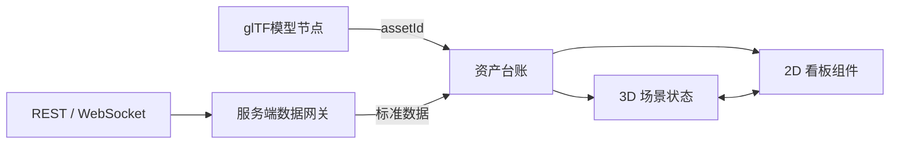

# 工厂数字孪生平台：启动准备与首期方案

> 目标：做一套供交付人员使用的“工厂数字孪生项目生成器”。它不是通用低代码平台，不售卖给终端客户；每个项目通过标准模型、资产台账、数据源和行业模板，快速交付一个可运行的 2D + 3D 看板。

## 1. 首期边界

### 要做

- 工厂场景的 GLB/GLTF 模型导入、校验、浏览、对象选中、高亮、隐藏和镜头定位。
- 以 `assetId` 为唯一主键，把模型对象、设备资产和实时/历史数据关联起来。
- 工厂总览、产线、设备详情、能耗、告警五类预制看板页面/弹窗。
- REST 轮询与 WebSocket 实时订阅；后端统一接入和转发，前端不直接保存或暴露客户系统凭证。
- 交付人员配置、预览、发布一个项目；交付后的大屏为只读运行态。

### 首期不做

- 类 EasyV 的无限画布、任意组件市场、任意 JS 脚本和多人的在线协同编辑。
- BIM/CAD 的原始格式直接渲染、倾斜摄影、GIS 城市级场景、云渲染、Unreal。
- 浏览器直接连接 OPC UA、PLC、MQTT 等工业网络；这些协议以后由服务端采集适配器处理。
- 一个项目中不受限制地混用多套模型坐标、多个数据规范。

## 2. 前端配置：不是两个独立产品，而是一个项目配置台

结论：需要分别配置 2D 和 3D，但不建议做成两个互不关联的独立后台。应以“项目”为入口，在同一配置台中分为以下工作区：

1. **项目与模板**：从空白或工厂模板创建新项目、修改名称、删除项目、配置客户信息、屏幕分辨率和主题。模板中心创建独立新项目，不覆盖已有项目；画布首次保存后由服务端按保存版本生成轻量封面。
2. **3D 场景**：使用独立编辑页导入 GLB 或自包含 GLTF，在一个场景组件中组合最多 32 个模型实例，设置每个实例的名称、显隐、位置、旋转和缩放，并完成主模型检查、节点选择、初始镜头、可点击对象和状态材质配置。2D 画布中的 3D 组件只保留配置摘要和入口；独立页始终编辑同一个画布节点，保存后把结果增量写回画布，不维护两份会漂移的配置。
3. **资产与数据**：导入资产台账、维护 `assetId`，添加数据源，字段映射和状态规则。
4. **2D 看板**：在固定尺寸、有边界的交付画布中拖入白名单组件，配置指标、图表、基础图形、告警列表、说明文字和点击联动；支持吸附、辅助线和预览，但不扩展为无限画布、组件市场或用户脚本平台。当前已落地折线图、柱状图、面积图、饼图、环形图、雷达图、指标卡、环形进度、进度排行、状态矩阵、数据排名、实时告警、业务表格、事件时间线、矩形、圆形、大屏标题、背景点缀、时间日期、标题、小卡片背景、小图标背景，以及纯文本、文字超链接、图片、轮播图、按钮、Switch、多选框、单选框和下拉菜单；纯文本支持水平/垂直滚动，链接与表单交互仅在预览态启用，图表、业务列表和文字按容器尺寸重排，圆形与小图标背景保持 1:1 等比缩放。
5. **预览与发布**：模拟数据检查、全屏预览、发布版本、生成访问地址和回滚。

运行态只有一个组合大屏：3D 为主视区，2D 作为两侧指标区、顶部概览区、详情抽屉和弹窗。点击 3D 设备、2D 告警或产线，都会围绕同一个 `assetId` 联动。



## 3. 关键数据标准（先定再开发）

### 3.1 资产台账：每个项目必须提供

交付时使用 Excel/CSV 导入，最小字段如下：

| 字段 | 含义 | 示例 |
| --- | --- | --- |
| `assetId` | 全局唯一、稳定的资产编号 | `LINE01-ROBOT-001` |
| `name` | 设备或区域名称 | 焊接机器人 1 号 |
| `type` | 设备类型/区域类型 | `robot` |
| `modelNode` | 对应 GLB 节点名 | `Robot_001` |
| `parentAssetId` | 所属产线或车间 | `LINE01` |
| `dataKey` | 数据系统中的设备键 | `A10001` |
| `enabled` | 是否在大屏展示 | `true` |

导入后系统自动按 `modelNode` 匹配，并列出未匹配、重复匹配、重复 `assetId`、缺失节点等**阻断发布**的问题；人工确认后才可保存映射。

3D 编辑器中的节点树必须从浏览器实际加载成功的主模型 glTF 场景生成。编辑会话可以使用子节点索引路径展开和选择对象，但该路径不能作为长期业务标识；持久化绑定仍使用经过唯一性检查的 `modelNode` 名称，并最终关联到 `assetId`。场景内每个模型实例只保存稳定实例 ID、资源 ID、名称、显隐和整体变换；节点位置、旋转、缩放、颜色、透明度和显隐按主模型原值加稀疏覆盖保存，不复制完整场景树。未命名或重名节点不可配置，单个 3D 组件当前最多保存 32 个模型实例、100 个节点变换和 100 个节点外观。材质外观在运行时按对象克隆应用，不能直接修改可能被多个实例共享的原始材质。

### 3.2 数据标准：网关输出给前端的统一结构

```json
{
  "assetId": "LINE01-ROBOT-001",
  "timestamp": "2026-07-15T08:30:00Z",
  "values": {
    "status": "running",
    "output": 26,
    "temperature": 48.2,
    "alarmLevel": 0
  }
}
```

每个字段还需定义：单位、数值类型、刷新/采样时间、是否可空、枚举值、阈值、陈旧时间（stale time）和展示名称。所有图表与状态规则只读这份标准数据，不直接耦合客户原始接口。

### 3.3 状态规则：首期内置、项目可配置

| 状态 | 示例规则 | 3D 表现 |
| --- | --- | --- |
| 运行 | `status = running` | 正常色 |
| 停机 | `status = stopped` | 灰色 |
| 预警 | `alarmLevel = 1` | 黄色描边/呼吸 |
| 告警 | `alarmLevel >= 2` | 红色高亮 |
| 数据失联 | `now - timestamp > staleTime` | 灰色虚线或失联标识 |

规则冲突、无效枚举值和数据超时必须在配置台与运行态可见，不能被默认正常状态掩盖。

## 4. 数据源设计

数据源以“服务端数据网关”为边界：网关保存密钥、鉴权并记录请求/订阅状态；浏览器只获取经授权的标准数据和项目配置。

### 4.1 首期必须支持

| 类型 | 适用场景 | 关键配置 | 运行要求 |
| --- | --- | --- | --- |
| REST 轮询 | MES、ERP、能耗/历史查询接口 | URL、方法、鉴权、参数、响应路径、轮询间隔 | 有超时、频率上限、错误日志、陈旧数据标记 |
| WebSocket | 设备状态、告警、产量实时推送 | 地址、鉴权、订阅报文、消息路径、心跳规则 | 指数退避重连、订阅恢复、连接状态可见 |

当前 P1 已落地一条受控的本地 REST 竖切链路：服务端只在显式启用且目标主机位于白名单时，按资产读取已保存的数据源和字段映射；请求带超时、拒绝重定向、限制 256 KiB 响应体，并严格校验 JSON 路径和值类型。REST 数据源可保存源时间戳路径，并以字段映射的陈旧时间判定“HTTP 200 但数据停止更新”。预览态以 `assetId` 将结果同时用于 3D 状态颜色和点击后的 2D 详情；采集失败会立即显示失联，时间戳过期会显示数据陈旧，二者都显示重连次数且只把最后成功值作为诊断快照。它用于验证契约，不代替后续生产级集中调度、批量缓存、凭据解析和 WebSocket 连接管理。

### 4.2 可作为第二阶段的接入方式

- SSE：单向服务端推送，适合部分业务系统。
- MQTT / OPC UA：由部署在客户内网的服务端采集器接入，再转换为统一数据；不暴露到浏览器。
- 数据库/时序库：用于历史趋势、班次报表及数据回放。
- Excel/Mock：仅用于交付演示、接口联调与验收，必须在运行态标明为模拟数据。

### 4.3 必须先向客户确认的接口契约

1. 每个数据点是否可追溯到稳定 `assetId` 或可映射的 `dataKey`。
2. 实时数据的典型频率、峰值并发、单条消息大小、历史数据保留时间。
3. 鉴权方式、网络位置（公网/VPN/客户内网）、白名单、证书及安全责任边界。
4. API 限流、允许轮询频率、WebSocket 订阅与心跳协议、断线后的补数方式。
5. 字段含义、单位、告警等级和“数据不可用”的业务定义。

## 5. 资源加载与性能方案

性能目标不是“模型一定一次性全加载”，而是把可交付的场景控制在明确预算内，并在导入时尽早发现不合格资源。

### 5.1 资源规范

- 首期仅接收 glTF 2.x 的 `.glb` 和 `.gltf`；单文件 `.gltf` 必须内嵌 buffer 与纹理，存在外部资源引用时要求模型供应方转换为 `.glb`。
- 节点名必须稳定、语义明确，不能把随机导出名称当作长期绑定依据。
- 导入时检查文件体积、节点数、三角面数、材质数、纹理尺寸、缺失纹理、重复节点名、坐标单位和包围盒。
- 入库后进行优化：几何压缩（Meshopt/Draco）、纹理压缩（KTX2/Basis）、删除不可见/无效对象，并保留原始文件与优化报告。
- 大厂区按车间/楼层/区域拆成资源包；首屏只加载当前可见区域，其余按镜头/交互预加载。

### 5.2 首期性能预算（待以首个真实模型校准）

| 项目 | 首期建议目标 |
| --- | --- |
| 首屏关键资源 | 优化后不超过 30 MB |
| 单个普通工厂项目总 3D 资源 | 优化后建议不超过 150 MB，超出必须按区域拆分 |
| 首屏可交互时间 | 常规办公网络目标 5 秒内 |
| 实时状态刷新 | UI 合并批量刷新，默认不超过每秒 1 次 |
| 普通设备上帧率 | 常用视角稳定 30 FPS 以上 |

这些是首期验收阈值而非保证值。最终预算需用第一家客户的真实 GLB、目标电脑、浏览器和网络共同压测后固化。

### 5.3 前端运行策略

- 静态资源放对象存储/CDN，按内容哈希缓存；项目配置和数据接口不得被 CDN 缓存为过期数据。
- 模型、纹理、图标、图表库按需加载；首屏优先模型骨架、关键状态和核心 KPI。
- 3D 渲染在用户交互、镜头动画和数据状态变化时驱动；空闲时降频，避免无意义满帧渲染。
- 高频原始数据先在网关和前端批处理，再更新 UI；禁止一个数据点一条 DOM/渲染刷新。
- 设备数量大时使用实例化、区域裁剪、LOD；不可见区域不参与高成本渲染。
- 单个 3D 场景内的批量模型共享一套 renderer、相机、灯光、控制器和动画循环；同一资源只下载、解析一次，再克隆为多个复用几何与材质的实例。首期最多保存 32 个实例，实际可流畅数量仍以三角面、材质、纹理、动画和目标显卡联合压测为准。
- 启动时检查 WebGL/显卡能力和显存压力；不满足条件时明确告知原因、设备信息和可处理方式，不伪装成正常看板。

## 6. 首期用户操作流程

1. 从工厂总览模板创建“某工厂”新项目；模板不会覆盖已有项目，进入画布确认后显式保存并生成项目封面。
2. 上传 GLB/GLTF，处理导入检查中明确报出的模型问题，设置楼层/车间分组与默认镜头。
3. 导入设备资产台账，解决所有未匹配的模型节点和资产编号。
4. 添加 REST 或 WebSocket 数据源，在网关中验证连通性并映射到标准数据字段。
5. 配置设备状态规则，选择 2D 模板与各槽位所显示的指标/图表/告警。
6. 检查预置联动：3D 点设备打开详情；点告警定位并高亮设备；切换产线/班次后同步更新。
7. 运行“发布前检查”：模型、资产、数据源、字段、阈值、性能和权限均通过后发布。
8. 生成只读访问链接或 Docker 部署包；后续修改必须产生可回滚的发布版本。

## 7. 开发前必须准备的材料

### 我方要先定的产品决策

- 首个细分场景：离散制造工厂，还是更具体到汽车零部件/电子装配等。
- 首期默认分辨率：建议 1920×1080；是否同时支持大屏与 PC 运维端。
- 五类预制页面的确切内容、品牌主题、交付物形式（云端链接还是客户现场 Docker）。
- 角色范围：首期至少“交付管理员”和“只读访客”；是否需要客户管理员。
- 首期浏览器与目标硬件的最低标准。

### 需要拿到的样本

- 1 份真实或脱敏 GLB/GLTF 模型，附节点命名说明和原始单位。
- 1 份设备资产台账 Excel。
- 1 个脱敏 REST 接口样例，和 1 个 WebSocket 消息/订阅协议样例。
- 目标部署网络拓扑：客户内网、数据系统位置、服务器规格、域名/证书方式。
- 1 套客户希望看到的总览/产线/设备详情页面参考图，以及验收指标列表。

## 8. 里程碑与验收

| 阶段 | 可见成果 | 通过条件 |
| --- | --- | --- |
| P0：标准确认 | 模型、资产、数据、页面的样本与契约 | 样本能完整描述一个设备从模型到数据的关系 |
| P1：可跑通原型 | GLB/GLTF 浏览 + 一台设备的 REST/WS 状态联动 | 真实或脱敏数据可驱动 3D 状态和 2D 详情 |
| P2：交付配置台 | 导入、映射、模板配置、预览、发布前检查 | 交付人员不改代码即可完成一个标准项目 |
| P3：首个项目交付 | 已发布的组合大屏、部署文档、性能报告 | 满足客户约定的功能、数据正确性、性能与安全验收 |

## 9. 当前结论与下一步

当前架构采用“一个项目配置台，分开配置 3D、数据和 2D；一个组合运行大屏”的方式。先把三个标准打牢：**glTF 资源规范、资产台账规范、数据接口规范**。首个真实模型已用于 P1 导入与渲染验证；后续仍需真实资产台账和数据样本，避免把客户个例写成通用产品逻辑。

## 10. 已落地的工程基线

仓库采用 pnpm workspace：`apps/web` 是 React + Vite + TypeScript 前端，`apps/api` 是 TypeScript Cloudflare Worker API。两者当前只构成可验证的基础设施：前端会显式检查 `GET /health`，后端返回带 `requestId` 的健康状态或明确的 404 错误。

Cloudflare D1 `factory-digital-twin-config` 已创建并由 Worker 配置绑定。业务 schema 由 `apps/api/migrations/` 按序演进；部署环境必须成功应用对应迁移后，API 才能依赖新增表或组件类型。当前画布节点按组件增量保存，迁移已覆盖身份权限、画布基础、六类图表、基础图形、大屏点缀、八类数据展示/业务组件、基础内容/交互组件以及图片资源元数据。图片二进制与模型一样进入对象存储，画布只保留受控资源 ID；图片组件最多绑定 1 张，轮播图最多绑定 12 张。图表最多保存 32 个静态数据点，数据排名最多 12 项，实时告警与事件时间线最多 20 项，业务表格最多 8 列、20 行；连续实时数据不得追加进画布 JSON。

当前已进入 3D 场景组件原型：实现独立 3D 编辑页、GLB/自包含 GLTF 导入、独立对象存储、基础检查、最多 32 个模型实例的场景组合、实例级整体变换/显隐、共享 WebGL 渲染器和相同资源单次解析。主模型支持实际场景节点树、模型对象点击与节点树双向选择、编辑态包围框高亮，以及节点位置/旋转/缩放和颜色/透明度/显隐的稀疏覆盖与画布预览；所有实例的内嵌动画由同一动画循环驱动。独立页提供大视口和完整属性面板，进入前先保存画布，并通过同一个 `canvasNodeId` 增量保存和回传配置；画布右侧只保留摘要与入口。轻量场景配置保存纯色/透明背景、环境光、主光源、初始视角和 FOV；HDR 环境贴图与天空盒后续作为独立资源接入，不进入画布 JSON。项目资产台账与唯一命名模型节点的绑定已落地：稳定 `assetId` 与数据库记录主键分离，支持新建绑定、已有资产绑定、修改与保留台账的解绑，重复编号和重复节点由服务端阻断。项目级 REST 轮询与 WebSocket 数据源配置也已形成独立契约，只保存连接元数据与服务端凭据引用，不保存明文密钥；已保存 REST 数据源支持受主机白名单、超时、重定向和响应体上限保护的连接测试，并有边界地发现标量 JSON 字段路径、类型和样例。已绑定资产可以按行配置数据源、唯一指标键、JSON 字段路径、值类型、单位和数据过期时间，映射不进入画布 JSON。P1 本地 REST 竖切已经能按映射严格读取模拟设备数据，通过 `assetId` 驱动 3D 状态色，并在点击对象后打开 2D 指标详情；中断请求会明确显示失联、错误原因、重连次数和最后成功快照。该链路默认关闭并受目标主机白名单保护，不代表生产级数据网关已完成。项目管理现已支持模板创建独立新项目、名称修改、负责人/管理员永久删除，并在首次保存画布后按保存版本动态生成项目卡片 SVG 封面；封面不保存截图二进制，也不复制画布 JSON。下一步需要用真实或脱敏 REST 样本验证契约，再实现集中调度、批量缓存、凭据解析和 WebSocket 连接管理。

资源库已增加“AI 场景底座”前端素材预检组件，用于验证单图极速背景、环拍视频和多图写实漫游的交互路径。当前只在浏览器本地检查格式、数量、体积、名称、输出偏好、镜头范围和已知尺寸，不上传文件、不创建重建任务，也不把生成能力描述为已落地。后续实现必须把视觉场景底座与可测量、可碰撞的工程模型分开，并先补齐对象存储、异步 GPU 任务、失败可观测性、预览校准、版本化发布和运行态资源契约。

## 2026-09-09 前端架构补充

厂房室内、多模型和 2D 数据联动的局限及选型决策已记录在 [厂房场景架构评估与技术选型](./docs/厂房场景架构评估与技术选型.md)。本轮保留 React + TypeScript + Vite + Three.js，增加场景运行层、增量资源/实例管理、本地压缩模型解码、静态 BVH 拾取与诊断，具体边界见 [前端场景运行架构](./docs/frontend-scene-runtime.md)。后端暂缓；当前不包含物理行走、区域 LOD、GPU Instancing 或独立 3D 的实时 2D 浮层。
